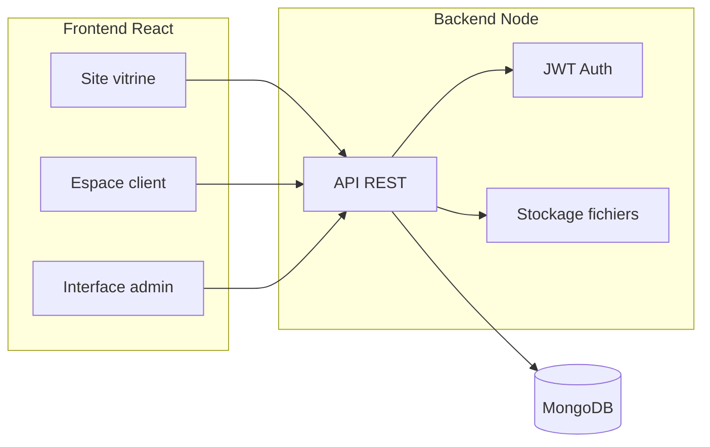

# Backend suivi dossiers et projets clients Venio

Plan d’action pour l’ajout d’un backend dédié au suivi des dossiers et projets clients : espace client (connexion, suivi projets, téléchargement devis/factures/fichiers), interface admin Venio pour gérer projets et documents.

## Avancement

Derniere mise a jour : 2026-02-01

- Backend initiale cree : `backend/` avec `npm init` + dependances (Express, Mongoose, JWT, multer, etc.)
- Fichier d’exemple de config : `backend/.env.example`
- Serveur Express + connexion MongoDB : `backend/src/index.js`
- Modeles Mongoose : `User`, `Project`, `Document`, `ProjectUpdate`
- Middleware JWT + role admin : `backend/src/middleware/auth.js`, `backend/src/middleware/role.js`
- Routes client : `GET /api/projects`, `GET /api/projects/:id`, `GET /api/projects/:id/documents`
- Routes admin : creation comptes clients, CRUD projets, ajout de mises a jour, upload documents
- Endpoint admin comptes clients : `GET /api/admin/users/:userId`
- Endpoint admin documents : `GET /api/admin/projects/:id/documents`
- Endpoint admin updates : `GET /api/admin/projects/:id/updates`
- Stockage fichiers : `backend/uploads/` + ecriture sous `uploads/projects/<projectId>/<type>/...`
- Frontend auth : `AuthProvider`, `ProtectedRoute`, helper API `src/lib/api.js`
- Espace client : pages `Login`, `Dashboard`, `ProjectDetail`
- Admin : pages `AdminLogin`, `AdminDashboard`, `Comptes clients`, `Creation projet`, `Detail projet`
- Routes ajoutees dans `src/App.jsx` + lien "Espace client" dans `Navbar`
- Proxy Vite ajoute pour `/api` vers `http://localhost:3000`
- Fichier `.env` cree dans `backend/` + ignore dans `.gitignore`

---

## Contexte actuel

- Frontend : React + Vite, port 5001 (`vite.config.js`), routes dans `src/App.jsx` (Home, Services, Pôles, Réalisations, À propos, Contact, Legal).
- Aucun backend ni appel API ; formulaire Contact non envoyé côté serveur.

---

## Architecture cible



- **Backend** : nouveau dossier `backend/` à la racine du repo (Node.js, Express, Mongoose).
- **Frontend** : mêmes sources, nouvelles routes `/espace-client/*` (clients) et `/admin/*` (Venio), avec protection par rôle.

---

## 1. Stack technique backend

| Composant | Choix                                                               |
| --------- | ------------------------------------------------------------------- |
| Runtime   | Node.js                                                             |
| Framework | Express                                                             |
| ODM       | Mongoose                                                            |
| Base      | MongoDB                                                             |
| Auth      | JWT (access + refresh optionnel)                                    |
| Fichiers  | `multer` + stockage local `backend/uploads/` (structuré par projet) |

---

## 2. Modèle de données (Mongoose)

**Un compte = un client, plusieurs projets par compte.** Pas d’entité Client séparée : un **compte** (User avec rôle CLIENT) = un client. Un seul compte par client ; ce compte peut avoir **plusieurs projets**, indépendants les uns des autres.

- **User** : `email` (unique), `passwordHash`, `role` (enum: `CLIENT`, `ADMIN`), `name`, `createdAt`. Index unique sur `email`. Si rôle CLIENT, ce user est “le client” (un seul compte par client).
- **Project** : `name`, `description`, `client` (ref: `User` — le compte client qui possède ce projet), `status` (enum: `EN_COURS`, `EN_ATTENTE`, `TERMINE`, etc.), `createdAt`, `updatedAt`. Chaque compte client peut avoir **plusieurs projets**, indépendants.
- **Document** : `project` (ref: `Project`), `type` (enum: `DEVIS`, `FACTURE`, `FICHIER_PROJET`), `originalName`, `storagePath`, `mimeType`, `uploadedAt`, `uploadedBy` (ref: `User`). Optionnel : `downloadedAt` pour le suivi “vu”.
- **ProjectUpdate** (timeline) : `project` (ref: `Project`), `title`, `description`, `createdAt`, `createdBy` (ref: `User`).

Relations : **User** (rôle CLIENT) 1–N **Project** (un compte a plusieurs projets) ; Project 1–N Document, Project 1–N ProjectUpdate. L’utilisateur connecté (CLIENT) voit uniquement **ses** projets.

---

## 3. API REST (backend)

- **Auth**
  - `POST /api/auth/login` (email + password) → JWT.
  - `GET /api/auth/me` (header `Authorization`) → utilisateur courant.

- **Côté client (utilisateur connecté, rôle CLIENT)**
  - `GET /api/projects` → liste des **projets du compte** connecté (tous les projets dont `client` = l’utilisateur).
  - `GET /api/projects/:id` → détail projet + documents + mises à jour (vérif que le projet appartient à l’utilisateur).
  - `GET /api/projects/:id/documents` → liste des documents du projet.
  - `GET /api/documents/:id/download` → téléchargement du fichier (vérif que le document appartient à un projet du compte).

- **Côté admin (rôle ADMIN)**
  - Comptes clients = utilisateurs avec rôle CLIENT : `GET /api/admin/users?role=CLIENT` (liste des comptes clients), `POST /api/admin/users` (création d’un compte client : email, name, password, role: CLIENT).
  - CRUD projets : `GET /api/admin/projects`, `POST /api/admin/projects` (body : `clientId` = id du User CLIENT, name, description, status), `PATCH/DELETE /api/admin/projects/:id`. Pour lister les projets d’un compte : `GET /api/admin/users/:userId/projects` ou filtrer `GET /api/admin/projects?clientId=...`.
  - Upload : `POST /api/admin/projects/:id/documents` (multipart, avec `type`: DEVIS | FACTURE | FICHIER_PROJET).
  - Timeline : `POST /api/admin/projects/:id/updates` pour ajouter une mise à jour projet.

- **Sécurité** : middleware JWT sur toutes les routes `/api/*`, puis middleware “role” pour les routes `/api/admin/*` (réservé ADMIN). CORS configuré pour le frontend (ex. `http://localhost:5001`).

---

## 4. Stockage des fichiers

- Répertoire : `backend/uploads/` (ignoré par Git sauf un `.gitkeep`).
- Structure : `uploads/projects/<projectId>/<type>/<uuid>-<originalName>` (ex. `devis`, `facture`, `fichier_projet`). Chaque projet a son dossier ; les projets sont indépendants.
- Les routes de téléchargement lisent le fichier depuis `storagePath` et renvoient le stream avec les bons headers `Content-Disposition` et `Content-Type`.

---

## 5. Frontend – Nouvelles pages et routes

**Espace client** (routes sous `/espace-client`)

- `/espace-client/login` : formulaire connexion (email / mot de passe), redirection vers dashboard après succès.
- `/espace-client` (ou `/espace-client/dashboard`) : liste de **tous les projets du compte** connecté (cartes avec nom, statut, dernière mise à jour). Un seul compte = un client ; chaque projet est indépendant.
- `/espace-client/projets/:id` : détail d’un projet (timeline des mises à jour + liste des documents avec boutons “Télécharger” pour devis, factures, fichiers projet).

**Interface admin** (routes sous `/admin`)

- `/admin/login` : connexion réservée aux comptes ADMIN.
- `/admin` : dashboard (accès rapide aux comptes clients et aux projets).
- Comptes clients = utilisateurs rôle CLIENT : `/admin/comptes-clients` (liste des comptes), `/admin/comptes-clients/nouveau` (création d’un compte : email, nom, mot de passe).
- `/admin/comptes-clients/:userId` : fiche du compte + **liste des projets** de ce compte ; action : ajouter un projet.
- `/admin/projets/nouveau` : création d’un projet (sélection du compte client dans une liste, puis nom, description, statut).
- `/admin/projets/:id` : édition projet (statut, etc.), ajout de documents (upload devis/facture/fichier), ajout de mises à jour (timeline).

**Navigation** : dans `src/components/Navbar.jsx`, ajouter un lien “Espace client” vers `/espace-client` (visible pour tous ; la page login ou dashboard s’affiche selon l’état connecté). Le lien “Admin” peut être uniquement sur `/admin` ou en lien discret (ex. footer ou URL directe).

**Auth côté frontend** : Contexte React (ex. `AuthContext`) : stockage du token (localStorage ou sessionStorage), utilisateur courant (`/api/auth/me` au chargement). Composants “ProtectedRoute” : redirection vers `/espace-client/login` ou `/admin/login` si non connecté (et pour `/admin/*`, vérifier le rôle ADMIN).

---

## 6. Bonuses proposés

- **Notifications email** : à l’upload d’un nouveau devis/facture ou à l’ajout d’une mise à jour projet, envoi d’un email au client (nodemailer + config SMTP dans `.env`). Optionnel, à brancher après la première version.
- **Marquer comme “vu”** : champ optionnel sur `Document` (ex. `viewedAt` ou `downloadedAt`) mis à jour au premier téléchargement, pour que l’admin sache quels documents le client a consultés.
- **Mot de passe oublié** : `POST /api/auth/forgot-password` + token temporaire par email + page “Réinitialiser le mot de passe” dans l’espace client. À prévoir dans le schéma (token + expiry) si vous voulez l’inclure dès le début.

---

## 7. Structure des dossiers (résumé)

```
Venio/
├── backend/
│   ├── src/
│   │   ├── models/       # schémas Mongoose (User, Project, Document, ProjectUpdate)
│   │   ├── index.js      # entry, Express app, connexion MongoDB, CORS
│   │   ├── middleware/
│   │   │   ├── auth.js   # JWT verify
│   │   │   └── role.js   # admin only
│   │   ├── routes/
│   │   │   ├── auth.js
│   │   │   ├── projects.js   # client: list, detail, documents
│   │   │   ├── documents.js  # download
│   │   │   └── admin/
│   │   │       ├── users.js      # liste/création comptes clients (role=CLIENT)
│   │   │       └── projects.js
│   │   └── controllers/  # logique métier
│   ├── uploads/           # fichiers uploadés (hors Git)
│   ├── package.json
│   └── .env.example      # MONGODB_URI, JWT_SECRET, PORT (ex. 3000)
├── src/
│   ├── context/
│   │   └── AuthContext.jsx
│   ├── pages/
│   │   ├── espace-client/
│   │   │   ├── Login.jsx
│   │   │   ├── Dashboard.jsx
│   │   │   └── ProjectDetail.jsx
│   │   └── admin/
│   │       ├── AdminLogin.jsx
│   │       ├── AdminDashboard.jsx
│   │       ├── ClientAccountList.jsx   # liste des comptes clients (users role=CLIENT)
│   │       ├── ClientAccountDetail.jsx  # fiche compte + ses projets
│   │       ├── ClientAccountNew.jsx     # creation d’un compte client
│   │       ├── ProjectForm.jsx
│   │       └── ProjectDetail.jsx
│   └── App.jsx           # nouvelles routes
```

---

## 8. Ordre d’implémentation suggéré

1. **Backend** : initialiser le projet Node (Express, Mongoose), modèles Mongoose (User, Project, Document, ProjectUpdate), connexion MongoDB, `POST /api/auth/login` et `GET /api/auth/me`, middleware JWT.
2. **API projets/documents** : routes client (liste/détail projets du compte, liste documents, download) + routes admin (liste/création comptes clients = users role CLIENT, CRUD projets avec `clientId` = userId, upload documents). Stockage fichiers : `uploads/projects/<projectId>/...`.
3. **Frontend auth** : `AuthContext`, stockage token, `ProtectedRoute`, appels API login/me.
4. **Espace client** : pages Login, Dashboard (liste des projets du compte), ProjectDetail avec appels API et boutons téléchargement.
5. **Interface admin** : AdminLogin, dashboard, liste et fiche **comptes clients** (users CLIENT) avec leurs projets, création projet (choix du compte client), formulaire création/édition projet, upload documents, création de mises à jour (timeline).
6. **Navbar / liens** : lien “Espace client”, lien “Admin” si souhaité.
7. **Optionnel** : email à la nouvelle pièce/mise à jour, “vu/téléchargé”, forgot password.

---

## 9. Port et CORS

- Backend : écouter sur un port dédié (ex. **3000**), configurable via `process.env.PORT`.
- Frontend reste sur 5001. Dans Vite, ajouter éventuellement un proxy vers `http://localhost:3000` pour les requêtes `/api` afin d’éviter les soucis CORS en dev (ou configurer CORS côté Express pour `http://localhost:5001`).
- Base : **MongoDB** — variable d’environnement `MONGODB_URI` (ex. `mongodb://localhost:27017/venio` ou Atlas).
